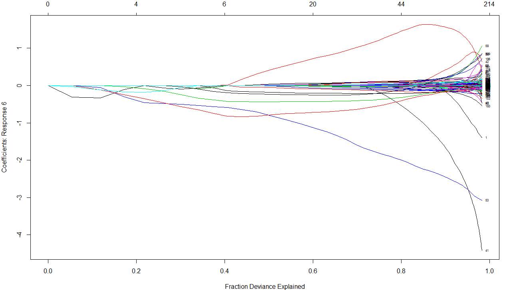
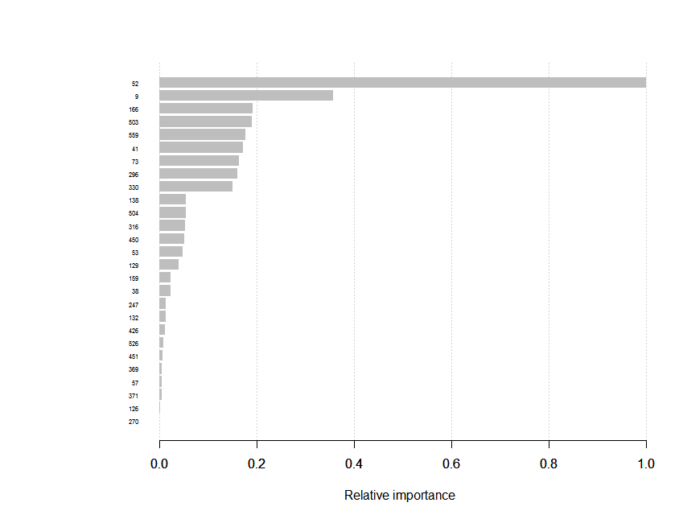

#读取数据
需要用到的包
```R
library("data.table")
library("reshape2")
library("RCurl")
library("tidyr")
```

下载并解压数据包
```R
setwd("C:/Users/wutong/Documents/GitHub/GettingAndCleaningData_Cousera/Project")
path <- as.character(getwd())
url<- "https://d396qusza40orc.cloudfront.net/getdata%2Fprojectfiles%2FUCI%20HAR%20Dataset.zip"
f <- "Dataset.zip"
if(!file.exists(path)){
  dir.create(path)
}
if(!file.exists(f)){
  download.file(url, file.path(path, f))
}
executable  <- file.path("C:","Program Files", "7-Zip", "7z.exe")
parameters <- "x"
cmd <- paste(paste0("\"", executable, "\""), parameters, paste0("\"", file.path(path, f), "\""))
system(cmd)
path_data <- file.path(path, "UCI HAR Dataset")
if(!file.exists(path_data)){
  dir.create(path_data)
}

```

读取各个文件。这里对几个文件进行简单的介绍：

 - X_train, X_test 总共有10000+记录，每条数据包含手机传感器手机561个不同特征数值。
 - Y_train, Y_test总共有10000+记录，每条数据包含每条记录对应的运动（walking，sitting，laying等6个）
 - subject_train.txt, subject_test.txt总共有10000+记录，代表每条数据来自的被试编号。一共有30名被试

```R
dtSubjectTrain <- fread(file.path(path_data, "train", "subject_train.txt"))
dtSubjectTest <- fread(file.path(path_data, "test", "subject_test.txt"))
dtActivityTrain <- fread(file.path(path_data, "train", "Y_train.txt"))
dtActivityTest <- fread(file.path(path_data, "test", "Y_test.txt"))
#The input data(x data) in format "ANSI",can't read by "fread"
#Use data table to read the file
fileToDataTable <- function(f) {
  df <- read.table(f)
  dt <- data.table(df)
}
dtTrain <- fileToDataTable(file.path(path_data, "train", "X_train.txt"))
dtTest <- fileToDataTable(file.path(path_data, "test", "X_test.txt"))
```
由于给的X文件不是ASCII编码，这里需要使用data.tale来读取
#数据清理
将subject，X，Y合到一张表上。
```R
setnames(dtSubjectTrain, "V1", "subject")
setnames(dtSubjectTest, "V1", "subject")
setnames(dtActivityTrain, "V1", "activityNum")
setnames(dtActivityTest, "V1", "activityNum")
dtTrain <- cbind(dtSubjectTrain, dtTrain, dtActivityTrain)
dtTest <- cbind(dtSubjectTest, dtTest, dtActivityTest)
setkey(dtTrain, subject, activityNum)
setkey(dtTest, subject, activityNum)
names(dtTrain)
```
```R
 ##[1] "subject"     "V1"          "V2"          "V3"          "V4"          "V5"          "V6"         
 ##[8] "V7"          "V8"          "V9"          "V10"         "V11"         "V12"         "V13"        
 ##[15] "V14"         "V15"         "V16"         "V17"         "V18"         "V19"         "V20"        
 ##[22] "V21"         "V22"         "V23"         "V24"         "V25"         "V26"         "V27"        
 ##[29] "V28"         "V29"         "V30"         "V31"         "V32"         "V33"         "V34"        
 ##      ...    
 ##[540] "V539"        "V540"        "V541"        "V542"        "V543"        "V544"        "V545"       
 ##[547] "V546"        "V547"        "V548"        "V549"        "V550"        "V551"        "V552"       
 ##[554] "V553"        "V554"        "V555"        "V556"        "V557"        "V558"        "V559"       
 ##[561] "V560"        "V561"        "activityNum"
```
修改列名为参数名
```R
dtTrain <- setnames(dtTrain, 2:562, dtFeatures$featureName)
dtTrain <- setnames(dtTrain, 2:562, dtFeatures$featureName)
names(dtTrain)
```

```R
 ##[1] "subject"                              "tBodyAcc-mean()-X"                   
 ##[3] "tBodyAcc-mean()-Y"                    "tBodyAcc-mean()-Z"                   
 ##[5] "tBodyAcc-std()-X"                     "tBodyAcc-std()-Y"                    
 ##[7] "tBodyAcc-std()-Z"                     "tBodyAcc-mad()-X"                    
    ...
 ##[547] "fBodyBodyGyroJerkMag-min()"           "fBodyBodyGyroJerkMag-sma()"          
 ##[549] "fBodyBodyGyroJerkMag-energy()"        "fBodyBodyGyroJerkMag-iqr()"          
 ##[551] "fBodyBodyGyroJerkMag-entropy()"       "fBodyBodyGyroJerkMag-maxInds"        
 ##[553] "fBodyBodyGyroJerkMag-meanFreq()"      "fBodyBodyGyroJerkMag-skewness()"     
 ##[555] "fBodyBodyGyroJerkMag-kurtosis()"      "angle(tBodyAccMean,gravity)"         
 ##[557] "angle(tBodyAccJerkMean),gravityMean)" "angle(tBodyGyroMean,gravityMean)"    
 ##[559] "angle(tBodyGyroJerkMean,gravityMean)" "angle(X,gravityMean)"                
 ##[561] "angle(Y,gravityMean)"                 "angle(Z,gravityMean)"                
 ##[563] "activityNum"  
```

#Feature Selection & Dimension Reduction 
由于数据维度达到561个，为了保证建模的效率以及防止过拟合，首先需要进行Feature Selection或者降维

##相关性 - Feature Selection
```R
correlationMatrix <- cor[dtTrain[,2:562]]
dtTrain_selected1 <- subset(dtTrain, select = -highlyCorrelated)
highlyCorrelated <- findCorrelation(correlationMatrix, cutoff = 0.5)
featureSelected <- setdiff(c(1:561),highlyCorrelated)
```
以下是具有较高相关性的特征，已去掉577个具有高相关性的特征变量
```R
## [1]   2   3  29  33  37  38  39  56  58  59  60  64  65  66  73  78  79  80  81  82  83 107 109 113 115 117 118
##[28] 119 120 122 123 157 158 159 160 162 163 188 189 192 193 197 198 199 200 226 238 252 264 291 292 293 301 310
##[55] 324 338 371 372 377 379 381 389 403 417 449 450 451 452 456 459 468 475 477 482 496 512 525 538 541 551 552
```
##Lasso特征选择
lasso是用来做特征选择的一种常用方式，lasso回归能够将不重要的feature系数降到0，来达到特征筛选的目的。
```R
set.seed(42)
idx = sample(c(TRUE, FALSE), nrow(dtTrain), replace = TRUE, prob = c(0.8, 0.2))
la_train = subset(dtTrain, idx)
la_train_labels  = subset(dtActivityTrain, idx)
x <-as.matrix(la_train) 
y <- la_train_labels
fit = glmnet(la_train, la_train_labels, family = "multinomial", type.multinomial = "grouped")
plot(fit, xvar = "lambda", label = TRUE, type.coef = "2norm")
plot(fit, xvar = "dev", label = TRUE)
cvfit=cv.glmnet(x, y, family="multinomial", type.multinomial = "grouped", parallel = TRUE)
plot(cvfit)
```
如图，随着惩罚力度lamda增大，更多的feature参数降为0，同时剩余feature所能反映矩阵差异性降低（更多信息丢失）。
```R
##[27,]  44  8.012e-01 0.0371300
##[28,]  43  8.124e-01 0.0338300
##[29,]  46  8.228e-01 0.0308300
##[30,]  48  8.327e-01 0.0280900
##[31,]  51  8.421e-01 0.0255900
##[32,]  54  8.509e-01 0.0233200
##[33,]  57  8.592e-01 0.0212500
##[34,]  59  8.674e-01 0.0193600
##[35,]  64  8.750e-01 0.0176400
##[36,]  67  8.823e-01 0.0160700
##[37,]  69  8.892e-01 0.0146500
##[38,]  73  8.957e-01 0.0133400
##[39,]  79  9.018e-01 0.0121600
##[40,]  82  9.075e-01 0.0110800
##[41,]  84  9.129e-01 0.0100900
##[42,]  84  9.179e-01 0.0091980
##[43,]  83  9.225e-01 0.0083810
##[44,]  84  9.267e-01 0.0076360
##[45,]  87  9.308e-01 0.0069580
##[46,]  88  9.346e-01 0.0063400
##[47,]  95  9.382e-01 0.0057770
##[48,]  99  9.416e-01 0.0052630
```
通过cross validation我们找到最佳的lamda值
如果，lamda值没有在区间内实现收敛，我们可以根据对信息丢失比率、feature数量综合选择合适的lamda。


为了和通过相关性分析的筛选结果进行比较，选择84个特征。
```R
f84 <- coef(fit, s = 0.0095)
la_features_84 <- f84[2:85] -1
```
```R
## [1]   1  10  23  26  29  33  37  38  39  40  41  42  51  53  56  57  58  63  64  66  70  74
##[23]  78  79  90  92  93  95 103 105 106 113 115 118 119 120 143 150 153 157 159 160 180 183
##[45] 186 187 188 193 197 198 199 210 211 223 237 276 296 297 298 299 301 303 317 355 370 372
##[67] 373 375 379 412 434 435 450 451 452 458 459 460 509 510 527 538 554 559
```

##Xgboost特征选择
Xgboost迭代树模型会在结果中返回feature importance用来评估feature的重要性
```R
##Xgboost要求label为[0, num_class),需要对label进行变换
y <- as.interger(y)-1
bst <- xgboost(data = x, label = y, max_depth = 2,eta = 1, nthread = 2, nround = 2, objective = "multi:softmax",num_class = 6)
importance_matrix <- xgb.importance(colnames(x), model = bst)
xgb.plot.importance(importance_matrix, rel_to_first = TRUE, xlab = "Relative importance")
```
xgb给出了24个feature
```R
##    Feature         Gain      Cover Frequency
## 1:     V53 0.3278639335 0.10822273   0.09375
## 2:     V10 0.1173552022 0.05943747   0.03125
## 3:     V42 0.0726383503 0.04095835   0.06250
## 4:    V167 0.0644388301 0.05943747   0.03125
## 5:    V504 0.0626122128 0.01955553   0.03125
## 6:    V297 0.0552989769 0.07116164   0.06250
## 7:    V317 0.0536771034 0.05943747   0.03125
## 8:    V560 0.0524143900 0.05943747   0.03125
## 9:     V75 0.0470504797 0.01635036   0.03125
##10:    V451 0.0316309796 0.05201701   0.06250
##11:    V303 0.0278317048 0.06028782   0.06250
##12:    V136 0.0185785825 0.03311688   0.03125
##13:    V130 0.0144114412 0.03396821   0.03125
##14:    V505 0.0122918813 0.05943751   0.06250
##15:     V39 0.0083273863 0.03987157   0.03125
##16:    V372 0.0072304677 0.04308704   0.03125
##17:    V160 0.0061725699 0.01407763   0.03125
##18:    V133 0.0050072860 0.05089357   0.06250
##19:    V519 0.0044794290 0.01266766   0.03125
##20:    V248 0.0043322465 0.03988180   0.03125
##21:    V527 0.0023687263 0.02005143   0.03125
##22:     V41 0.0022102299 0.01776307   0.03125
##23:    V433 0.0013308848 0.01620514   0.03125
##24:    V373 0.0004467052 0.01267518   0.03125
```
Feature相对重要性如下图

#建模
##聚类分析
下面我们尝试使用聚类，看PCA给出的成分能否实现activity的分类。以下是用来画层次聚类图的两个函数
```R
hclusterplot <- function(data, column){
  distanceMatrix <- dist(data[,column])
  myplclust(hclustering, lab.col = unclass(data$activity), main = as.character(column[length(column)]-1))
}

myplclust <- function(hclust, lab = hclust$labels, lab.col = rep(1,length(hclust$labels)), hang = 0.1, ...){
  y <- rep(hclust$height,2)
  x <- as.numeric(hclust$merge)
  y <- y[which( x < 0 )]
  x <- x[which( x < 0 )]
  x <- abs(x)
  y <- y[order(x)]
  x <- x[order(x)]
  plot(hclust, labels = FALSE, hang = hang, ...)
  text(x = x, y = y[hclust$order] - (max(hclust$height)*hang), labels = lab[hclust$order], col = lab.col[hclust$order], srt = 90, adj = c(1,0.5), xpd = NA, ...  )
}
```

我们使用了3主成分，和10主成分用来进行层次聚类。得到了下图。6个颜色代表两个分类。我们发现层次聚类能够将activity很好的分为两类。但很难提供更多信息。

对PCA获得主成分，使用Kmeans聚类。
```R
clusterdata <- merge(clusterdata, dtActivityNames, by = "activityNum", all.x = TRUE)
kClust <- kmeans(clusterdata[2:4],centers = 6, nstart = 100)
table(kClust$cluster, clusterdata$activityName)
```
```R
#    LAYING SITTING STANDING WALKING WALKING_DOWNSTAIRS WALKING_UPSTAIRS
#  1      6       1        0     431                271              350
#  2    808     748      801       0                  0                0
#  3      0       0        0      82                200               10
#  4     22      15        1     355                122              578
#  5    571     522      572       0                  0                0
#  6      0       0        0     358                393              135
```
从结果看，无论使用层次聚类还是KMeans聚类，都仅能将activity分为两类：静止类：laying，sitting，standing；运动类：walking，walking_downstairs, walking_upstairs.无法提供更多信息。
